# 🔐 Linux Attack and Response Lab

## 📌 Project Overview
This lab demonstrates a full attack lifecycle against a Linux system followed by structured incident response and forensic analysis. Acting first as an attacker and then as an incident responder, the objective was to exploit a vulnerable Java-based web application, establish remote access, and analyze the resulting artifacts left on the compromised system.

The lab highlights how client-side exploitation leads to system compromise and how defenders can identify, investigate, and document indicators of compromise using Linux-based tools and logs.

---

## 🧪 Lab Environment
- Attacker Machine: Kali Linux (External Network)
- Victim Machine: Ubuntu Linux (Internal Network)
- Firewall: pfSense (Network Segmentation)

Tools Used:
- Kali Linux
- Metasploit Framework
- Social-Engineer Toolkit (SET)
- Meterpreter
- Linux system utilities and logs

---

## 🔧 Environment Verification (Attacker)
The Kali Linux network configuration was validated using ifconfig to confirm required interfaces were active. The loopback interface was manually enabled using ifconfig lo up and re-verified to ensure proper system operation.

Evidence:
- 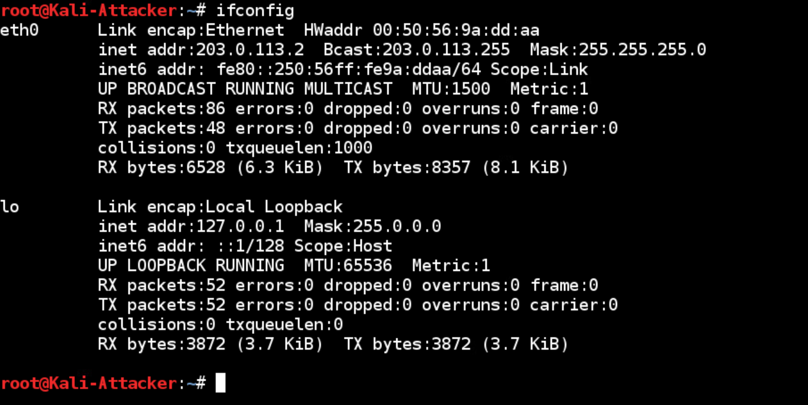
- 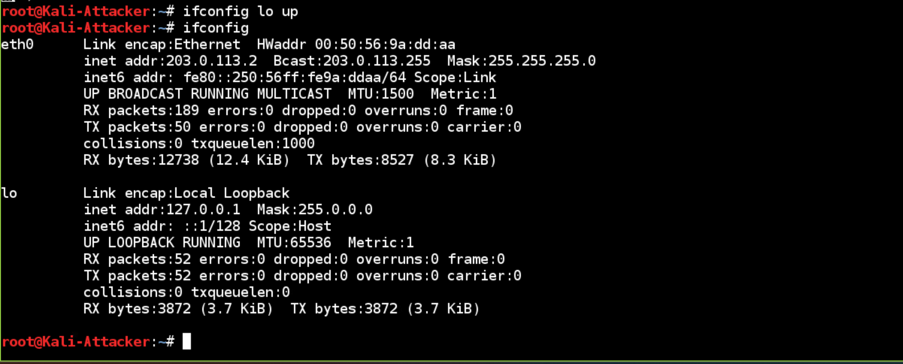

---

## ⚙️ Attack Preparation
The PostgreSQL service was started to support Metasploit session handling using:
service postgresql start

The Social-Engineer Toolkit was then launched to prepare the browser-based attack infrastructure using:
setoolkit

Evidence:
- 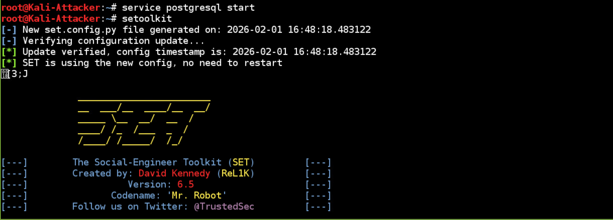

---

## ⚔️ Attack Execution – Java Web Exploit
Using SET, a browser-based Java 7 Applet Remote Code Execution attack was configured through the following path:
- Social Engineering Attacks
- Website Attack Vectors
- Metasploit Browser Exploit Method
- Web Templates (Java Required)

A Meterpreter reverse TCP payload was configured with the attacker IP address 203.0.113.2 and listening port 6666. The SET web server was started to host the malicious Java applet.

Evidence:
- 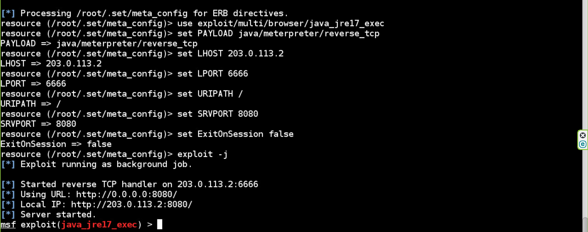

---

## 🎯 Exploit Validation
From the Ubuntu victim system, Firefox was used to access the malicious web server. Network connections were validated using:
netstat -nao | grep 6666

The output confirmed an established reverse TCP connection to the attacker system, validating successful exploitation.

Evidence:
- 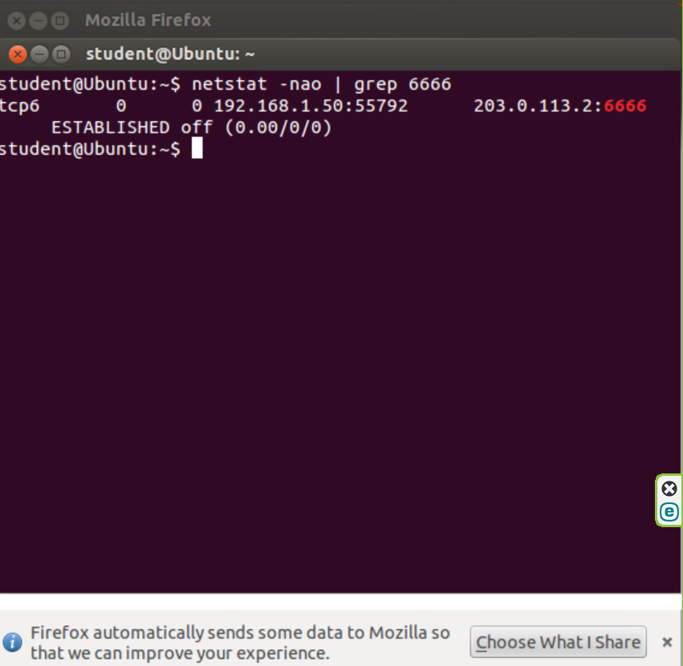

---

## 🔓 Meterpreter Session Established
Metasploit confirmed successful payload delivery and opened a Meterpreter session. Active sessions were enumerated using:
sessions

The session was then interacted with using:
sessions -i 1

Evidence:
- 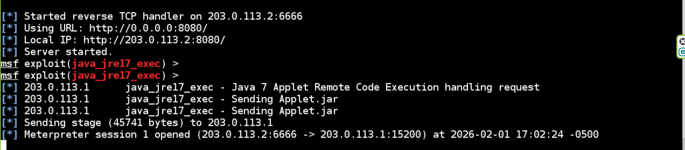
- 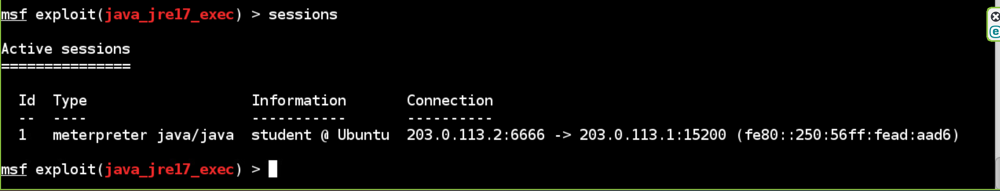
- 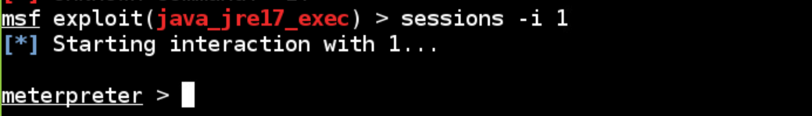

---

## 🧠 Post-Exploitation – System Identification
System metadata was collected using:
sysinfo

This confirmed the compromised host was the intended Ubuntu Linux system.

Evidence:
- 

---

## 👤 User Context Verification
The active user context was verified using:
getuid

The session was running under the student user account.

Evidence:
- 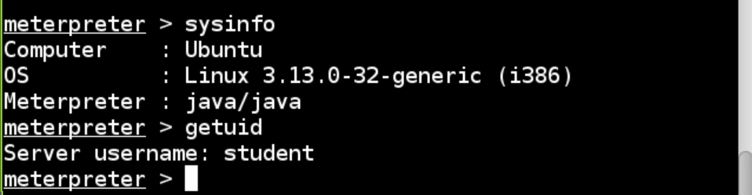

---

## 📊 Volatile Data Collection
Running processes were reviewed using ps, and a live screenshot of the victim’s desktop session was captured using:
screenshot

Evidence:
- 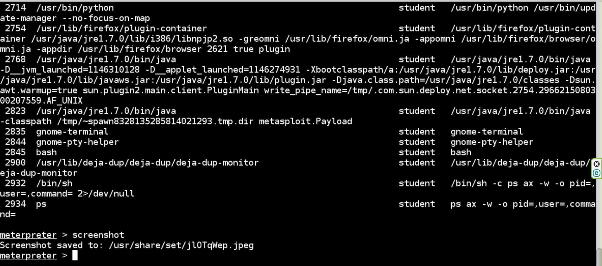

---

## 📁 Sensitive File Access
The /etc/passwd file was downloaded from the compromised system to demonstrate account enumeration capability using:
download /etc/passwd

Evidence:
- 

---

## 🐚 Shell Access Confirmation
An interactive shell was spawned from Meterpreter using:
shell
pwd

The output confirmed shell access under /home/student.

Evidence:
- 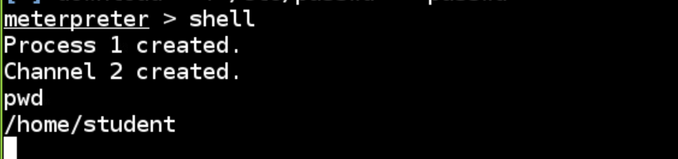

---

## 🔐 Privilege and Group Verification
User privileges were examined using:
id student

The account belonged to multiple groups, including sudo, indicating elevated privilege potential.

Evidence:
- 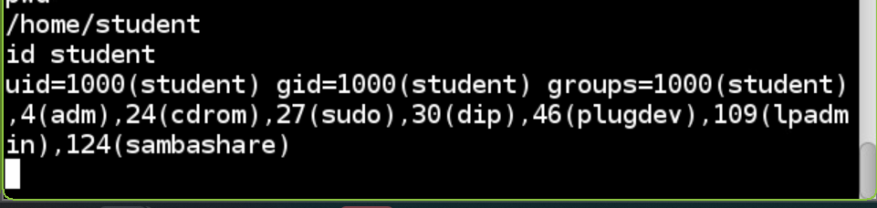

---

## 🚨 Privilege Escalation
Privilege escalation was confirmed on the Ubuntu system using:
sudo su

This successfully elevated access to the root user.

Evidence:
- 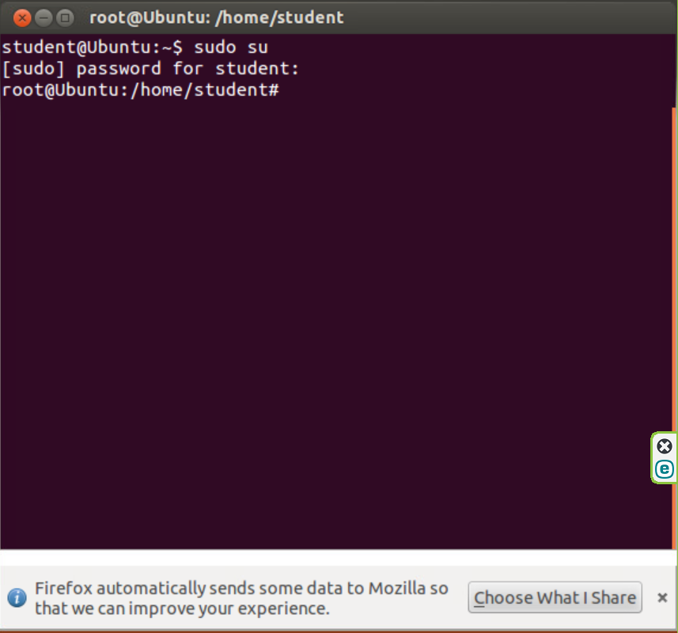

---

## 📝 Incident Response Report Creation
A structured incident response report was created to capture volatile system data using the following commands:
echo student investigator > report.txt
date >> report.txt
uname -a >> report.txt
hostname >> report.txt
ifconfig -a >> report.txt
netstat -ano >> report.txt
ps aux >> report.txt
route -n >> report.txt
cat report.txt | less

Evidence:
- 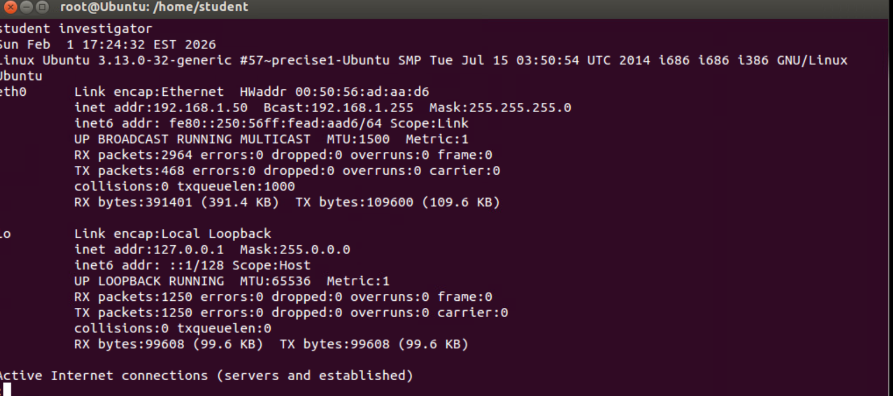
- 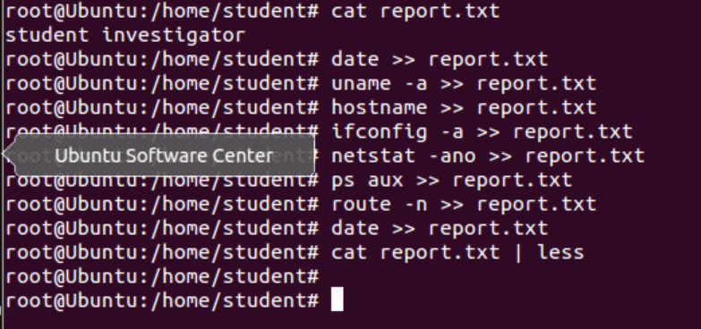

---

## 📜 Authentication Log Analysis
Authentication activity was reviewed using:
cat /var/log/auth.log | less

Evidence:
- 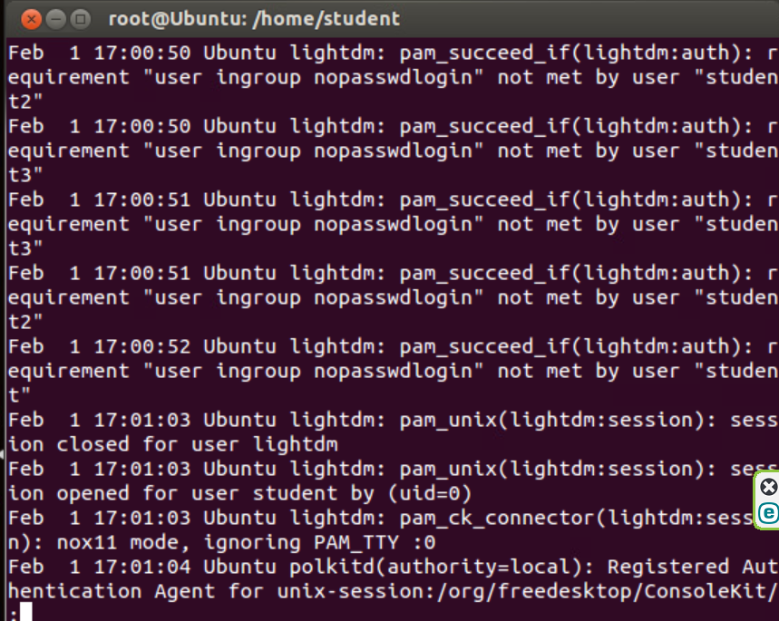

---

## 🕒 Login History Review
User login history was examined using:
lastlog

Evidence:
- 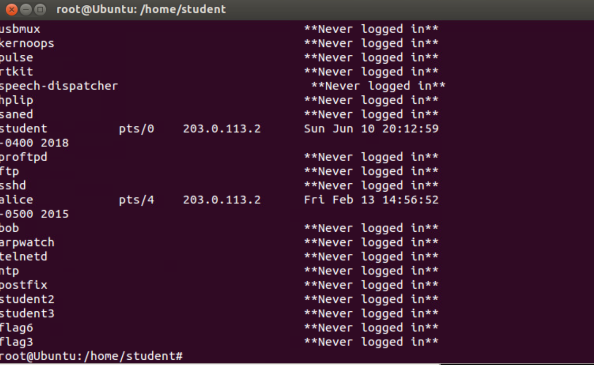

---

## 🧾 Session and Login Record Analysis
Failed and successful login records were analyzed using:
last -f /var/log/btmp | more
last -f /var/log/wtmp | more

Evidence:
- 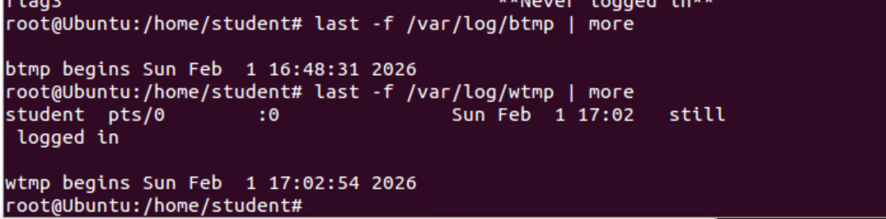

---

## 🚨 Indicators of Compromise (IOCs)
- Reverse TCP connection to external IP 203.0.113.2
- Unauthorized Java-based browser exploitation
- Meterpreter session activity
- Access to /etc/passwd
- Root privilege escalation via sudo
- Suspicious authentication and session logs

---

## 🛠️ Suggested Remediation
- Remove outdated and vulnerable Java components
- Enforce least-privilege access and restrict sudo membership
- Monitor outbound network connections
- Enable centralized logging and alerting
- Regularly review authentication and session logs
- Apply timely security patches

---

## 💡 Why This Matters
This project demonstrates the ability to execute and analyze real-world attack techniques, validate compromise through host and network artifacts, perform structured incident response and forensic triage, and translate technical findings into documented security insights.

These skills directly align with SOC Tier 1, Incident Response, and Junior Security Analyst responsibilities.
